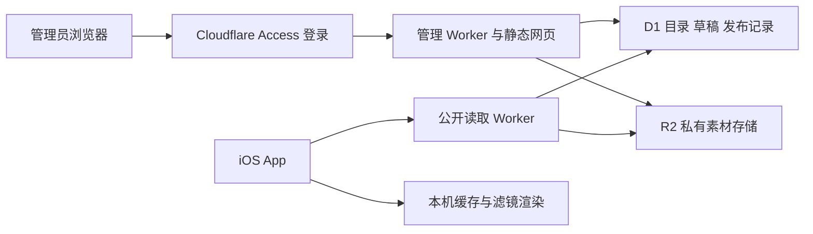

# LumiPortrait 滤镜管理后台开发计划

日期：2026-09-28。状态：方案，尚未实现或部署。

目标：在 Cloudflare 上部署一个由开发者使用的网页后台，管理 App 的滤镜名称、分类、顺序、素材和发布版本。用户照片继续在手机本地处理；后台只提供滤镜目录和经过验收的素材。

本计划按当前 LumiPortrait 工程、单个 App、单名管理员、公开免费滤镜设计。先完成现有滤镜的远程管理，再完成可下载 LUT 的完整闭环。以后增加符合已支持格式的 LUT，可以通过后台发布；新增算法或新的素材格式仍需要更新 App。

## 1. 当前工程与接入约束

本次核对分支为 `codex/editor-next-1.1`，提交为 `a78ad6d`；开始规划时工作区干净。以下是本次源码检查结果，不是运行验收结论。

| 已有能力 | 现状与对应文件 | 对后台的影响 |
| --- | --- | --- |
| 滤镜标识 | `Sources/Domain/Editing/Parameters/PortraitFilterPreset.swift` 定义固定枚举；正式能力列表包含 50 款效果和无滤镜状态 | 不能把任意远程字符串直接解码成现有枚举 |
| 首发目录 | `Sources/UI/Editor/Catalog/PortraitFilterCategory.swift` 开放人像 4 款、冷暖 5 款、胶片 5 款；另有收藏入口 | 首次导入后台保持这 14 款上架，其余已实现效果保留为未上架记录 |
| 名称与分类 | 名称来自本地化键；分类及组内顺序写在 Swift 中 | 需要增加目录模型和展示映射，才能响应后台编辑 |
| 强度与历史 | `PortraitFilterSettings.swift` 保存枚举标识、当前强度和每款效果的强度记忆；`PortraitEditRecipe.swift` 当前版本为 18 | 目录刷新不能改变既有强度、取消、撤销和重做语义 |
| 收藏 | `Sources/Settings/PortraitFilterFavoritesStore.swift` 保存本机预设标识 | 下架只影响展示；保留收藏记录。远程 LUT 接入时再迁移到可扩展标识 |
| 缩略图 | `PortraitFilterThumbnailLoader.swift` 根据当前照片在本机生成，按可见项调度并拒绝过期结果 | 后台封面用于管理浏览，不能替换 App 当前照片的效果预览 |
| 渲染 | GPUPixel 与 `PortraitColorFiltering` 共享本地效果链路；Core Image 创建集中在已审阅工厂 | 下载在资源层完成；渲染层只接收已验证本地资源，预览和导出使用同一实现 |
| 外部 LUT | `docs/filter-material-acquisition.md` 记录了候选素材与授权限制；这些素材尚未正式接入 | 不能把下载成功、格式通过或上传成功标记为可用效果 |

客户端实现继续遵守 `AGENTS.md`、`docs/code-directory-rules.md` 和 `docs/editor-tool-integration-rules.md`。本计划不修改现有算法，也不引入与其他 App 共享的运行时状态。

## 2. 交付范围

### 阶段 A：现有滤镜管理，形成第一个可用版本

管理员登录网页后，可以查看全部已有滤镜，搜索和筛选，编辑简体中文／英文名称与说明，调整分类及顺序，保存草稿、预览发布差异、发布和回滚目录。

App 增加远程目录读取与本地缓存，以后台已发布目录控制入口。仅开放客户端已经支持且经过验收的内置效果；不通过远程配置重新定义其算法参数。默认强度保持当前满强度，已有照片的独立强度记忆保持不变。

这一阶段的完成标准是：在后台调整胶片组顺序并发布，接入后的 App 刷新目录可看到变化；断网仍能使用本地滤镜。现有已安装旧版 App 不会自动获得接入能力，需要先发布一次客户端更新。

### 阶段 B：上传 LUT，完成素材分发与本地渲染

增加素材上传、结构校验、授权信息、资源版本和 App 下载管理；扩展滤镜引用、收藏与缩略图缓存，使远程 LUT 可以参与预览、强度调节、历史和导出。

这一阶段完成后，管理员可以上传符合约定的调色查找表[LUT]，在测试环境验收，发布到正式目录。后台不能下载或执行任意着色器、脚本和插件。

第一版暂不加入订阅付费、用户投稿、多 App 管理、自动生成滤镜、定时活动和使用行为分析；这些能力不影响当前滤镜管理闭环。

## 3. Cloudflare 架构

采用两个独立 Worker：管理员应用与 App 公共读取接口。这样管理员登录策略不会阻断手机获取公开目录，公共接口也不会包含写入路由。

| 服务 | 具体用途 | 选择理由 |
| --- | --- | --- |
| Workers + Static Assets | 管理网页、管理接口、公开目录与素材接口 | 一套部署平台即可运行网站和轻量接口；不维护虚拟机 |
| D1 | 滤镜、分类、草稿、资源索引、不可变发布快照和操作记录 | 适合关系与排序查询，也能在事务中更新发布记录 |
| R2 Standard | LUT 二进制、后台封面和私有授权资料 | 文件与数据库分开存放，具备免费用量及免费出口流量 |
| Cloudflare Access | 管理 Worker 的登录和管理员白名单 | 复用身份认证，不自行保存密码 |
| Workers Logs | 发布失败、接口错误、耗时及配额诊断 | 初期使用平台日志，不另建日志服务 |

后端使用 TypeScript，网页采用 Vite + React，数据库使用 D1 参数化 SQL 与版本化迁移；第一版不引入全栈服务端渲染框架。新增依赖先检查许可证、维护责任和固定版本。Workers AI 不参与滤镜管理和本地渲染。

后台命名为 **Lumi Console**，独立私有仓库为 [chenbingiOS/lumi-console](https://github.com/chenbingiOS/lumi-console)，已于 2026-09-28 创建；目前为空仓库，尚未初始化后台代码。本计划先保存在 App 的 `docs` 中。后台内部可按 `admin-web`、`admin-worker`、`catalog-worker`、`contracts`、`migrations`、`tests` 分目录。Cloudflare 的测试与正式环境分别配置 Worker、D1、R2 和 Access，测试发布不能写入正式资源。

## 4. 管理页面与日常操作

| 页面 | 第一版行为 |
| --- | --- |
| 滤镜列表 | 按分类、内置／LUT、草稿／上架状态筛选；显示名称、版本、排序和校验状态 |
| 滤镜编辑 | 不可变标识、双语名称与说明、分类、排序、效果类型、最低客户端要求；上传素材及管理用封面 |
| 分类管理 | 编辑双语名称、顺序及组内滤镜；收藏始终由客户端本机管理，不创建远程收藏分类 |
| 素材详情 | 文件大小、格式、哈希、维度、颜色空间、来源、授权依据、校验结果和验收说明 |
| 发布中心 | 展示相对当前线上版本的新增、删除、改名、排序和资源变化；校验通过后发布 |
| 发布历史 | 查看发布时间、操作者内部标识、说明、目录版本及回滚入口 |

典型流程：登录 → 编辑或上传 → 保存草稿 → 在测试 App 预览效果 → 检查发布差异 → 发布 → 核对 App → 必要时回滚。

阶段 A 的网页可以管理内置预设元数据，但网页不模拟 GPUPixel 的最终效果。阶段 B 可以用合成色卡检查 LUT 基础映射；正式观感和导出仍须由 iOS 渲染链路验收。演示素材只使用合成图或授权明确的素材，不上传用户照片。

## 5. 数据与接口契约

### 数据表

| 表 | 主要内容 |
| --- | --- |
| `categories` | 稳定分类标识、双语名称、排序、草稿修订号 |
| `filters` | 稳定滤镜标识、类型、分类、双语文案、排序、上架意向、草稿修订号 |
| `filter_versions` | 不可变效果版本、内置预设映射或 LUT 资源引用、渲染器版本、最低 App 版本与能力要求 |
| `assets` | 服务端生成的对象路径、SHA-256、字节数、用途、格式、校验状态、私有来源资料引用 |
| `releases` | 单调递增目录版本、完整不可变目录快照、快照哈希、发布说明、操作标识和时间 |
| `publication` | 当前环境唯一的生效版本指针和用于并发保护的修订号 |
| `released_assets` | 已发布版本引用的可分发资源索引；私有授权资料永不进入此表 |
| `audit_events` | 新建、编辑、发布、回滚等动作及目标；不记录照片、凭据或完整登录令牌 |

内置滤镜沿用现有 `rawValue`，例如 `portraitSkin`；远程滤镜使用新的命名空间，例如 `lut.<UUID>`，不能复用已有标识表达另一个效果。更换 LUT 文件必须新建内容版本。

目录包含 `schemaVersion`、`releaseVersion`、`publishedAt`、`categories`、`filters`。每个效果包含稳定 `id`、`contentRevision`、`kind`、双语文案、分类、排序、`minAppVersion` 和 `requiredCapabilities`。LUT 额外包含素材哈希、大小、格式、维度、颜色空间和渲染器版本；内置效果包含已知预设映射。

初始规模按最多 500 款滤镜设计，目录快照限制 512 KiB。限制属于本产品配置，不是 Cloudflare 的平台上限。输入与 SQL 全部参数化；重复标识、越界排序、空名称和非法资源关联在发布前拒绝。

### 接口

| 访问方 | 接口 | 约定 |
| --- | --- | --- |
| App | `GET /v1/catalog` | 返回完整已发布快照；支持实体标签[ETag]和 `304`；不返回草稿或授权资料 |
| App | `GET /v1/assets/{sha256}` | 只读取已发布索引允许分发的指定资源；支持 `HEAD`，不接受任意存储路径 |
| 管理员 | `/admin/api/filters`、`/categories` | 查询、创建和修改草稿；更新携带草稿修订号，冲突返回 `409` |
| 管理员 | `/admin/api/assets` | 有界上传并独立校验；失败资源不可发布 |
| 管理员 | `POST /admin/api/releases/validate` | 检查目录结构、能力要求、资源、双语文案、授权和验收记录 |
| 管理员 | `POST /admin/api/releases` | 带预期线上版本及幂等请求标识发布，返回最终目录版本 |
| 管理员 | `POST /admin/api/releases/rollback` | 从指定历史快照创建一个新的发布版本，保留回滚记录 |

公开读取接口不要求 App 用户登录；目录与滤镜是公开分发内容。App 内不保存管理员凭据，也不把跨域配置当作接口权限控制。付费滤镜若后续立项，需要另行设计权益验证。

## 6. 发布一致性、缓存和回滚

1. 先写入不可变 R2 对象并完成服务端校验，再允许目录引用；已发布路径不可覆盖。
2. 读取一个一致的草稿版本生成完整目录。发布期间如果草稿发生变化，拒绝混用新旧数据并提示重新检查。
3. 使用 D1 事务批次写入发布快照、分发资源索引、审计事件及当前版本指针。预期版本冲突必须令整个事务失败；不能把影响零行当成发布成功。幂等标识防止网络重试产生重复发布。
4. R2 与 D1 之间没有跨服务事务。只有上述 D1 提交成功才算发布；提前上传但未被发布引用的对象继续保持私有，可在宽限期后清理。
5. 第一版目录不做服务端长缓存：请求读取当前发布指针，客户端使用 ETag 和刷新间隔。素材按内容哈希缓存并保持不可变。流量增加后可启用 Workers Cache，对目录设置短缓存并给出明确的更新延迟。
6. 回滚从旧快照创建一个更高的 `releaseVersion`，保留原来的内容版本与资源哈希。客户端按发布版本前进，避免把回滚误认为过期响应。

App 冷启动先加载最近一次有效缓存，无缓存则使用随包 14 款目录；联网时后台检查新版本，建议间隔六小时，并提供重新检查入口。编辑中不热换当前面板快照，下一次安全进入时才应用新目录。

下架表示新目录不再提供该效果的新选择，不修改已选效果、旧收藏或历史。旧发布版本引用的资源第一版不自动删除，支持历史编辑重放；下载到设备的公开素材也无法承诺即时撤回。云端紧急回滚的实际到达时间受联网、客户端刷新和缓存影响。

## 7. LUT 格式与素材校验

为控制第一版兼容性，先支持输入为标准 sRGB、三维大小为 16、32、33 的 `.cube` 素材。输入域固定为 `[0,1]`，输出必须为有限且落在 `[0,1]` 的 RGB 值。拒绝一维 LUT、组合 LUT、缺行、多行、非法维数和未经约定的颜色空间。

管理员网页解析 `.cube`，生成固定布局的 `lut3d-rgba-f32le-v1` 二进制用于分发：小端 32 位浮点，红色轴变化最快，透明度恒为一。33³ 数据约 0.55 MiB；每个最终 LUT 上传限制 1 MiB，原始文本限制 4 MiB。服务器独立检查布局、长度、所有数值和哈希，不相信浏览器声明的“已通过”。App 下载后再检查一次。

解析与转换在管理员浏览器完成，避免把文本转换放进每次 App 请求。Worker 上传校验的最坏 CPU 时间必须实测；Workers Free 每次 10 ms 的限制属于交付门槛。若最大支持尺寸超限，先缩小免费版接收范围或实现有界分段校验，并如实标明支持范围；需要付费方案时单独评估，不自动升级账户。

当前候选素材中的 65³、DJI 专用输入、输出越界的 Night Vision，以及特殊 PNG 平铺格式，不自动进入第一版可发布范围。后续增加转换器时另做颜色空间、精度与视觉验收，不能静默降采样或裁切后冒充原效果。

LUT 必须记录作者、来源、授权依据及版本。服务器做结构与资料完整性检查，管理者确认授权和视觉验收；软件校验不能替代授权判断。授权文件保存在私有路径，公开目录只返回必要的署名内容。

后台封面仅支持有明确尺寸和字节限制的 PNG/JPEG，剥离不必要的元数据；封面与滤镜本体分开校验。第一版不接受任意压缩包、远程链接抓取、HTML 或 SVG。

## 8. iOS 接入计划

### 阶段 A 的目录接入

- 新增中立的目录模型、目录读取协议、随包目录提供者、远程读取实现和本地缓存实现。由 App 组装层注入，UI 不直接请求网络。
- 将分类和排序从固定枚举展示转换为目录数据，保留内置预设到现有算法的映射与首发目录回退。
- 新目录校验后一次性替换，不逐项写入生效文件；未知内置效果和不支持的能力只影响对应项目。根结构损坏、未知主协议版本或异常空目录则保留上一份有效目录。
- 内置效果优先使用已支持语言的现有本地文案；后台提供的简体中文和英文可覆盖对应语言，其他语言保留本地译文。新远程效果按当前语言、英文回退；中英字段必须齐全。

### 阶段 B 的素材接入

- 引入独立滤镜引用类型，区分内置预设与远程 LUT，并记录远程 `id + contentRevision + sha256 + rendererVersion`。配方版本在实施时从实际基线递增，兼容当前 `preset` 字段，不能直接破坏旧枚举解码。
- 既有内置编号、历史占位含义、零强度及强度记忆原样保留。扩展收藏和缓存身份以支持远程标识，收藏迁移可重复执行且不丢失隐藏记录。
- 使用 `URLSession` 下载、`CryptoKit` 校验，通过系统文件 API 原子落盘；新资源验证成功前不改变当前滤镜或照片。
- 下载队列限制并发，切图或换选后检查请求身份；过期完成可以缓存已验证资源，但不能覆盖新的选择或预览。
- 缩略图缓存键包含照片代次、滤镜内容版本和强度。只有可见项目生成当前照片效果预览，遵守已有主预览优先策略。
- 在已审阅的 Core Image 工厂内增加 LUT 节点，保持渲染层不联网；公开 API、轴顺序、输入颜色空间、强度混合、透明度和输出范围均需固定测试。
- 通过 `PortraitColorFiltering` 所属共享管线参与预览、局部修复后的外观阶段和正式导出，保持现有形变、修复、外观、裁剪顺序。

资源缓存使用可控空间预算，建议初始 100 MiB，并区分可清理下载缓存与当前编辑／历史正在引用的资源。被当前配方引用的素材必须固定保留到引用释放；如果以后加入持久化草稿，也必须同步持久化对应素材。

网络失败时继续使用最近有效目录和已有资源；新素材下载失败则保持原选择并提供重试。恢复中的资源缺失或渲染失败时保留原配方与最近成功画面，提示重新下载并阻止“缺少滤镜”的导出，不能静默保存另一种效果。没有选用远程滤镜的本地编辑不受后台故障影响。

所有新 Swift 类型单文件组织，类型、方法和关键并发／回退分支提供简体中文说明。新增 UI 文案保持中英键集相同。

## 9. 权限、存储与维护

- 管理 Worker 使用 Access 保护生产、预览和所有可达域名，仅允许指定管理员。Worker 检查经过验证的 Access 身份与预期应用；缺少有效身份直接拒绝。使用普通 Access 集成时需验证令牌签名、签发者、受众和有效期，不只信任邮箱请求头。
- 管理写入还检查同源请求与防跨站请求伪造机制；会话或跨域设置错误不能使匿名请求修改素材。登录由 Access 完成，后台不实现密码找回系统。
- R2 桶保持私有，关闭公开开发地址。公共 Worker 通过绑定读取已发布资源，按数据库索引生成路径；不暴露目录列表、上传接口或任意对象代理。
- 公共 Worker 只有读取代码路径，但 D1／R2 绑定本身不能被描述为数据库级只读授权。通过分离 Worker、严格输入、路由测试和最小部署权限减少误写风险。
- 用户照片、编辑配方及人脸数据不上传。必要的管理员身份由 Access 管理，应用日志只保留最少的内部操作标识；日志保留和平台访问日志应在隐私说明中准确说明。
- 免费版本也设置文件大小、数量、总存储和请求频率边界；记录额度接近阈值的提醒。提醒和业务限额不能被当作 Cloudflare 账单的绝对封顶开关。
- 每次正式迁移前导出 D1，发布快照及素材保存独立备份和校验清单。第一版不自动删除已发布素材；定期核对未引用草稿及历史占用。恢复演练同时核对代码、数据库和 R2，Worker 代码回滚不等于数据回滚。

## 10. 免费额度与成本边界

以下额度根据 2026-09-28 查询到的 Cloudflare 官方文档整理；实际开通和部署时再次检查账户计划、其他项目占用及当日条款。

| 项目 | 当前文档额度／计费规则 | 本方案影响 |
| --- | --- | --- |
| Workers Free | 每天 100,000 次请求；每次 10 ms CPU | 两个 Worker、两个环境和同账户其他服务共同占用相应额度；素材经 Worker 返回也计请求 |
| Static Assets | 直接静态资源请求免费且不限量 | 先运行 Worker 或启用会改变计费的缓存配置时，不能仍按纯静态免费推算 |
| D1 Free | 每天读 500 万行、写 10 万行；账户总存储 5 GB | “行数”不是接口请求数；发布快照和索引也占存储，另需遵守单库限制 |
| R2 Standard 免费用量 | 每月 10 GB-month、100 万次 A 类操作、1,000 万次 B 类操作；出口流量免费 | 超过免费用量按计费规则收费；免费出口不代表所有请求免费 |
| Access | 有免费计划；本方案先使用单管理员 | 开通 Zero Trust 并核对当前可用政策与账户要求 |

容量示例：100 款 33³ 浮点 LUT 的纯像素数据约 55 MiB，尚未包含封面、历史版本和备份。假设每天 1,000 名活跃用户，每人检查两次目录、发生三次未命中本机缓存的素材下载，则公开 Worker 约 5,000 次请求／天，具备落入免费用量的空间。这是预算示例，不能替代真实请求统计、CPU 测量或抗滥用验证。

无需先购买域名，可以用 `workers.dev` 完成部署和联调；正式分发再按可达性和品牌需要绑定域名，域名费用单列。R2／Zero Trust 的开通可能要求完善计费信息，以控制台实际要求为准；本次未核对账户的实时开通、支付或授权状态。

## 11. 实施顺序与完成标准

| 里程碑 | 工作 | 完成标准 |
| --- | --- | --- |
| M0 契约与原型 | 冻结字段、导入现有 50 款定义及 14 款开放状态、用合成夹具验证目录和 LUT 格式 | 数据映射无重复，旧标识含义不变，支持与不支持格式有明确样例 |
| M1 后台基础 | 建立独立工程、D1 迁移、管理网页、Access、发布与回滚接口 | 未登录不可写，草稿不可被 App 获取，并发／重复发布正确处理 |
| M2 内置目录接入 | App 目录协议、缓存、分类顺序、双语回退、旧收藏兼容 | 后台调整后可在 App 生效；离线首次启动和旧配方恢复正常；阶段 A 可交付 |
| M3 LUT 素材闭环 | 上传与服务端校验、资源下载、本地渲染、引用与缓存迁移 | 新 LUT 在预览和正式导出中效果一致，取消／撤销／重做与零强度正确 |
| M4 测试环境验收 | 部署独立测试资源，验证 Access、配额、弱网、发布回滚和真实设备 | 完整测试报告，明确性能、颜色和网络可达性结论；超限问题已处理 |
| M5 正式上线 | 正式资源初始化、备份恢复检查、发布首份目录、客户端版本发布衔接 | 正式 HTTPS 端点正常，目录与素材版本可追踪，故障回退和回滚演练通过 |

测试环境 App 使用独立配置读取测试环境已发布的候选快照，不能直接读取草稿，也不把测试地址带进正式包。上线初始目录保持既有 14 款，不在部署时自动开放全部隐藏效果。新增素材逐批验收后发布。

Cloudflare 落地时按以下顺序操作：

1. 核对目标账户和 Wrangler 登录，启用 Workers 子域名、R2 与 Zero Trust；已有 MCP 授权不能代替部署工具的登录验证。
2. 分别创建测试和正式 D1 数据库、私有 R2 桶；名称区分环境。先在测试库执行版本化迁移和初始目录导入。
3. 为每个 Worker 的环境配置显式数据库绑定 `DB` 和素材绑定 `FILTER_ASSETS`，管理网页构建产物由 Static Assets 承载。资源标识写入部署配置，凭据通过受保护的部署环境提供。
4. 完成本地测试与部署预检后，先部署测试管理 Worker；即使 Access 尚未配置，缺少有效身份的管理接口也必须默认拒绝。随后配置管理员白名单及所有管理域名保护。
5. 部署测试公开 Worker，发布测试快照，核对匿名写入被拒绝、目录可读、草稿不可读、素材哈希及回滚。测试 App 指向该环境完成联调。
6. 通过 M4 后备份正式库，执行正式迁移，部署两个正式 Worker，配置正式 Access 策略并发布初始目录。将正式读取地址加入 App 的发布配置，实际核对包内地址。
7. 保留本次部署版本、数据库迁移号、目录版本与素材哈希；完成正式只读探测及回滚演练，再衔接客户端发布。Worker 代码部署与滤镜内容发布采用独立版本记录。

上线前需要落实的配置是：目标 Cloudflare 账户、管理员登录身份、R2 与 Zero Trust 的开通状态、最终客户端最低版本。域名可后补；这些不妨碍先开发和本地验证。

## 12. 验证清单

后端使用 Workers 运行时测试工具覆盖：匿名写入拒绝、身份不匹配、跨站写入、参数校验、双语缺失、非法素材、哈希错误、草稿泄漏、发布原子性、并发冲突、幂等重试、回滚、资源索引和配额边界。网页端到端测试覆盖登录、编辑、排序、上传失败重试、发布差异和回滚。

客户端至少覆盖：

- 旧配方解码与收藏迁移；未知滤镜、版本及不支持能力；损坏目录和离线随包回退。
- 下载中断、文件被截断、哈希不符、空间不足、并发换选、旧完成回调和资源被固定保留。
- 合成灰阶／色卡／透明图的 LUT 轴顺序、颜色空间、强度为零／一及预览导出像素一致性。
- 分类与收藏滚动、当前强度记忆、确认／取消、全局撤销重做、下架后旧历史、跨工具与保存流程。
- 手机冷启动、弱网和完全离线、真实设备内存与耗时；目标用户网络下的 Cloudflare 可达性。

App 能力交付前执行 `./verify.sh static`、单元测试、模拟器构建和相应 UI 测试；每个能力批次更新测试和 `docs/feature-status.md`。真机、云端、模拟器与静态结果分别记录，未验证项不能写为完成。

2026-09-28 规划阶段仅交付本文，未新增后台或 App 运行能力，未创建 Cloudflare 资源，未上传素材或部署服务。该阶段 `./verify.sh static` 与新文档空白检查通过，未运行 App 单元测试、模拟器构建、UI 测试或真机测试；以上运行验证属于实施阶段的交付条件。

## 13. 官方参考

- [Workers 静态资源](https://developers.cloudflare.com/workers/static-assets/)
- [Workers 定价](https://developers.cloudflare.com/workers/platform/pricing/) 与 [运行限制](https://developers.cloudflare.com/workers/platform/limits/)
- [D1 定价](https://developers.cloudflare.com/d1/platform/pricing/)、[限制](https://developers.cloudflare.com/d1/platform/limits/) 与 [事务批次接口](https://developers.cloudflare.com/d1/worker-api/d1-database/)
- [R2 定价](https://developers.cloudflare.com/r2/pricing/) 与 [Workers 访问方式](https://developers.cloudflare.com/r2/get-started/workers-api/)
- [Workers 的 Access 保护](https://developers.cloudflare.com/workers/configuration/cloudflare-access/)
- [Workers Cache](https://developers.cloudflare.com/workers/cache/)
- [Workers 测试](https://developers.cloudflare.com/workers/testing/)

涉及额度与 Access 能力的上述页面已在本次通过 Cloudflare 官方文档工具查询；入口链接不代表已经在当前账户开通或实测。
